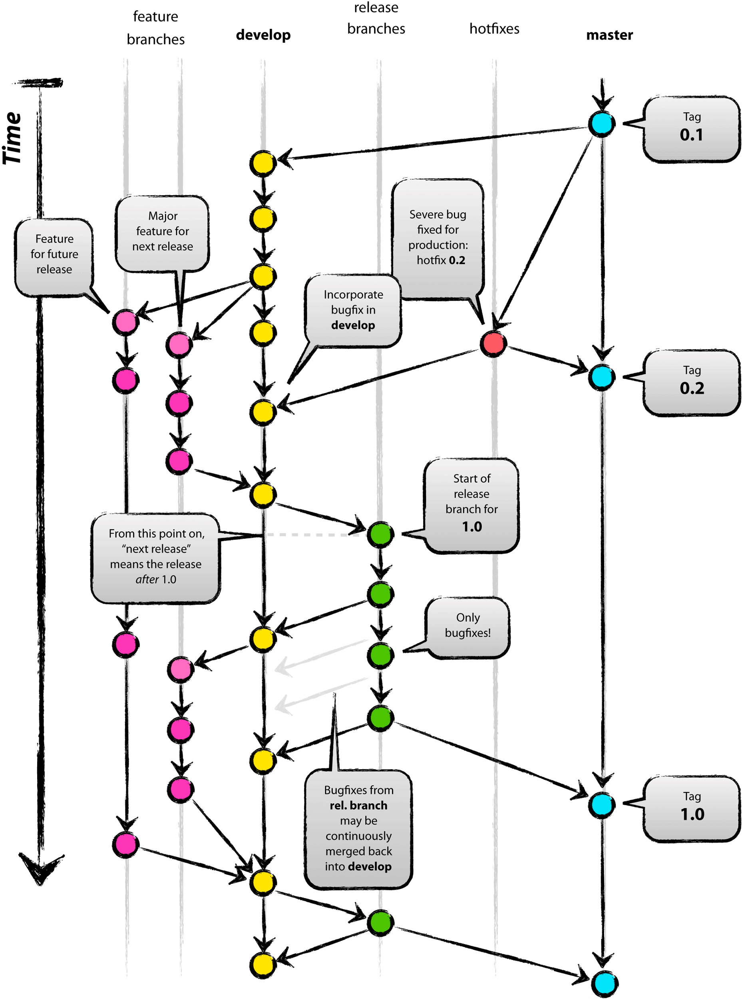
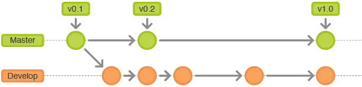

# Git Flow

* [Git Flow 常用分支](#git-flow-常用分支)
  * [master 分支](#master-分支)
  * [develop 分支](#develop-分支)
  * [feature 分支](#feature-分支)
  * [release 分支](#release-分支)
  * [hotfix 分支](#hotfix-分支)
* [Git Flow 如何使用](#git-flow-如何使用)
  * [master / develop 分支的使用](#master--develop-分支的使用)
  * [feature 分支的使用](#feature-分支的使用)
  * [release 分支的使用](#release-分支的使用)
  * [hotfix 分支的使用](#hotfix-分支的使用)

Git Flow 定义了一个项目发布的分支模型，为管理具有预定发布周期的大型项目提供了一个健壮的框架。

## Git Flow 常用分支

### master 分支

master 分支包含最近发布到生产环境的代码，以及最近发布的 release ， 这个分支只能从其他分支合并，不能在这个分支进行直接修改。

### develop 分支

develop 分支是主开发分支，包含所有要发布到下一个 release 的代码，这个分支主要与其他分支合并，比如 feature 分支。

### feature 分支

feature 分支主要用来开发新功能，一旦开发完成，将合并回 develop 分支并进入下一个 release 。

### release 分支

当需要发布一个新 release 的时候，基于 develop 分支创建一个 release ，完成 release 后，合并到 master 分支或 develop 分支。

### hotfix 分支

当在 master 分支发现新的 bug 时，需要创建一个 hotfix 分支，修复完 bug 后 ，合并回 master 分支或 develop 分支，所有 hotfix 分支的改动都会进入下一个 release 。

## Git Flow 如何使用

### master / develop 分支的使用

所有在 master 分支上的提交应该创建标签，一般情况下 master 分支不存在直接修改， develop 分支基于 master 分支创建。

### feature 分支的使用

feature 分支完成后，必须合并回 develop 分支，合并完分支后一般会删除这个 feature 分支，毕竟保留下来意义也不大。

### release 分支的使用

release 分支基于 develop 分支创建，创建完 release 分支之后，可以在这个 release 分支上进行测试，修改 bug 等。同时，其他开发人员可以基于 develop 分支创建新的 feature ，注意，一旦创建好 release 分支之后不要从 develop 分支上合并新的改动到 release 分支。发布 release 分支时，合并 release 分支到 master 分支或 develop 分支，同时在 master 分支上创建标签并记住 release 版本号，然后就可以删除 release 分支了。

### hotfix 分支的使用

hotfix 分支基于 master 分支创建，开发完毕后需要合并回 master 分支或 develop 分支，同时在 master 分支上创建标签。